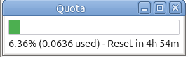
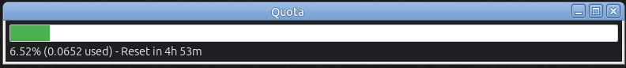

# firmware_showquota

Quota viewer for the Firmware API with both GUI and terminal modes. Shows current quota usage and a live 5-hour reset countdown.

API reference (quota endpoint): https://docs.firmware.ai/api-reference/quota

## Screenshots

| Light Mode | Dark Mode | Dark Mode (No Titlebar) |
|------------|-----------|-------------------------|
|  |  |  |

## Sneak peek (TTY colored)

Exact widths/colors depend on your terminal, but it looks like this:

```text
Firmware API Quota Details:
==========================
Usage: [██████████████░░░░░░░░░░░░░░] 63.20%
Reset: [████░░░░░░░░░░░░░░░░░░░░░░░] 12m 08s left (of 5h)
Resets at: 2026-01-21 18:05:00 CET

Refreshing every 60 seconds (Ctrl+C to stop)...
```

Notes:

- If stdout is not a TTY (piped to a file), colors are automatically disabled.
- If your locale is UTF-8, the bars use block characters; otherwise they fall back to ASCII.

### Compact mode example

```text
U:[██████████░░░░░░] 63%
R:[████░░░░░░░░░░░░] 12m8s
```

### Tiny mode example

```text
63%
```

## Requirements

### Terminal Mode
- Linux/macOS (works best in a real TTY)
- C++17 compiler (e.g. `g++`)
- libcurl development headers (`libcurl4-openssl-dev` on Debian/Ubuntu)
- nlohmann/json headers

### GUI Mode (Optional)
- GTK3 development libraries (`libgtk-3-dev`)
- libayatana-appindicator3 (`libayatana-appindicator3-dev`)
- libnotify (`libnotify-dev`)

Install GUI dependencies on Debian/Ubuntu:
```bash
sudo apt-get install libgtk-3-dev libayatana-appindicator3-dev libnotify-dev
```

## Build

The Makefile supports building three versions:

```bash
# Build all versions (recommended)
make all-versions

# Build individual versions
make text      # Terminal-only (no GUI dependencies)
make gui       # GUI-only version
make mixed     # Mixed version (terminal + GUI)
```

You can also install GUI dependencies with:
```bash
make install-deps-gui
```

## API key

You can pass the API key as an argument, or set it in an environment variable.

Export via environment variable (recommended):

```bash
export FIRMWARE_API_KEY="fw_api_xxx"
```

Then run:

```bash
./show_quota
```

## GUI Mode

### GUI Window

The GUI displays a compact, resizable window with:
- **Quota Usage** progress bar with percentage
- **Default width**: 150px (resizable horizontally, min 140px)
- **Fixed height**: 50px
- Window position and size are saved and restored on restart
- **Multi-monitor support**: Position is preserved across restarts on any monitor

### GUI Features

- **System Tray Integration**:
  - Custom Firmware logo icon displayed in system tray
  - Persistent tray presence - application runs in background even when window is hidden
  - Click tray icon to access menu
  - Right-click on window for quick access to menu

- **Color-Coded Visual Feedback**:
  - Progress bars change color based on quota usage
  - Green: <50% usage (healthy)
  - Yellow: 50-80% usage (moderate)
  - Red: ≥80% usage (high/critical)

- **Interactive Window**:
  - Displays real-time progress bar for quota usage
  - Shows percentage and time remaining until reset
  - **Double-click** on window to toggle titlebar on/off
  - **Drag** window from anywhere when titlebar is hidden
  - Close button hides window to tray instead of quitting

- **Desktop Notifications**:
  - Automatic alerts for quota reset events
  - High usage warnings when quota increases significantly
  - Non-intrusive desktop notifications (10-second timeout)

- **System Tray / Right-Click Context Menu**:
  - **Show Window** / **Hide Window**: Toggle main window visibility
  - **Save Position**: Manually save current window position and size
  - **Reset Position**: Move window back to primary monitor
  - **Auto-start on Login**: Toggle autostart via `~/.config/autostart/firmware_quota.desktop`
  - **Show Title Bar**: Toggle window decorations; when disabled you can drag the window from anywhere; double-click the window to toggle
  - **Dark Mode**: Toggle dark/light appearance
  - **Refresh Rate**: 15s / 30s / 60s / 120s
  - **Progress Bar Height**: Adjust thickness (1x–4x)
  - **Quit**: Exit application completely

- **Hover Tooltip**: Live status display showing current percentage and time until reset

- **All Terminal Features**: Full compatibility with logging, event detection, custom refresh intervals, and authentication methods

### GUI Technical Details

**Icon**: The application uses `firmware-icon.svg` or `firmware-icon.png` for the system tray. The icon should be in the same directory as the executable.

**Configuration**: GUI state is automatically saved to `~/.firmware_quota_gui.conf` and restored on startup:
- Window position (x, y) - multi-monitor safe
- Window width
- Visibility state
- Always on top setting
- Titlebar/decorated state
- Dark mode preference
- Refresh interval
- Progress bar height multiplier

**Autostart**: The tray `Auto-start on Login` toggle writes `~/.config/autostart/firmware_quota.desktop` which uses the wrapper script to start the best available GUI version.

**Threading**: Quota fetching runs in a background thread to keep the GUI responsive. Updates are displayed as soon as data is received.

**Main Window Components**:
- Quota Usage progress bar with percentage
- Color-coded bar that updates dynamically based on thresholds

**System Tray Components**:
- Persistent tray icon for quick access
- Live tooltip with current quota status
- Context menu for full application control

## Terminal Usage

Default behavior:

- Runs forever, refreshes every 60 seconds
- Logs to `./show_quota.log` by default
- Stop with Ctrl+C

Help:

```bash
./show_quota --help
```

Common examples:

```bash
# GUI mode with system tray
./show_quota --gui

# GUI mode with custom refresh interval
./show_quota --gui --refresh 120

# GUI mode without logging
./show_quota --gui --no-log

# Default terminal live view (60s refresh)
./show_quota

# Single run (no refresh loop)
./show_quota -1

# Refresh every 60 seconds (minimum supported)
./show_quota --refresh 60

# Disable logging
./show_quota --no-log

# Log to a custom file
./show_quota --log quota.csv

# Pure text output (no progress bars)
./show_quota --text

# Compact bar layout for ~40-column terminals
./show_quota --compact

# Tiny single-line layout
./show_quota --tiny

# Run inside a fixed-size xterm (default 80x8)
./show_quota_xterm.sh

# Compact xterm preset (80x3)
./show_quota_xterm.sh --compact

# Compact 40-column xterm preset (40x3)
./show_quota_xterm.sh --compact-40

# Tiny xterm preset (6x2, font size 20)
./show_quota_xterm.sh --tiny
```

## Run in xterm (80x8)

If you want a consistent layout for screenshots or a tiny dashboard window, run it inside xterm:

```bash
./show_quota_xterm.sh
```

By default the launcher uses a larger font for readability. You can override it:

```bash
SHOW_QUOTA_XTERM_FONT_FACE="DejaVu Sans Mono" SHOW_QUOTA_XTERM_FONT_SIZE=16 ./show_quota_xterm.sh
```

Pass any `show_quota` args through:

```bash
./show_quota_xterm.sh --refresh 60 --no-log

# Compact preset (80x3)
./show_quota_xterm.sh --compact

# Compact 40-column preset (40x3)
./show_quota_xterm.sh --compact-40

# Tiny preset (6x2, font size 20)
./show_quota_xterm.sh --tiny
```

If `wmctrl` is installed, the xterm will also be set to "always on top" (best-effort; depends on your window manager).

## What the output means

- `Usage` bar: quota usage percentage reported by the API.
- `Reset` bar: time remaining until the next reset.
  - The quota window is treated as a fixed 5 hours.
  - The bar drains toward the reset time.
  - Colors shift as reset approaches (green -> yellow -> red).

## Build Versions

The project supports three build configurations:

| Executable | Description | Dependencies |
|------------|-------------|--------------|
| `show_quota_text` | Terminal-only version | libcurl only |
| `show_quota_gui` | GUI-only version | libcurl, GTK3, libayatana-appindicator3, libnotify |
| `show_quota` | Mixed version (terminal + GUI) | All of the above |

**Wrapper Script**: `show_quota_wrapper.sh` automatically selects the best available executable.
